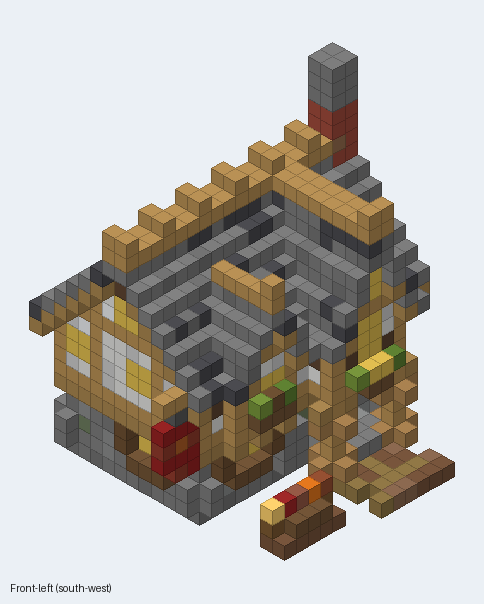
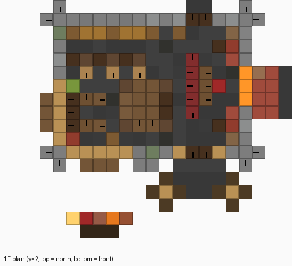
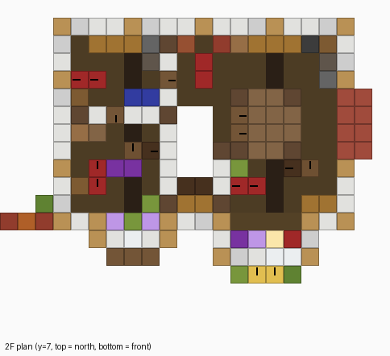
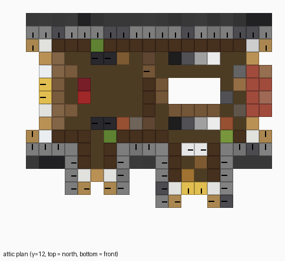

# 아늑한 선술집 (JpCore) — Litematica 홀로그램용 스키매틱

원본 영상: [Building a Cozy Minecraft Tavern — JpCore](https://www.youtube.com/watch?v=TZKiMj980wM)

영상의 완성된 외관과 **후반부 인테리어 투어**(벽난로 라운지 → 바 → 식당 → 계단 → 2층 방 → 다락)를
프레임 단위로 보고 블록으로 옮긴 재현 스키매틱입니다.

## 파일

| 파일 | 용도 |
| --- | --- |
| `cozy_tavern.litematic` | **Litematica 홀로그램(스키매틱 투영)** 용 |
| `cozy_tavern.schem` | WorldEdit / FAWE `//schem load` 용 (Sponge v2) |
| `preview/` | 외관·입면도·층별 평면도·단면 미리보기 |
| `build_tavern.py` | 스키매틱 생성 스크립트 (수정 후 `python3 build_tavern.py` 로 다시 생성) |
| `render_preview.py` | 미리보기 이미지 생성 (Pillow 필요) |

## Litematica 에 넣는 법 (Java 에디션)

1. `cozy_tavern.litematic` 을 `.minecraft/schematics/` 폴더에 넣는다
2. 게임에서 `M` → **Load Schematics** → `cozy_tavern` 선택 → **Load Schematic**
3. 설치할 자리에 서서 `M` → **Schematic Placements** 에서 위치·회전을 맞춘다
   - 스키매틱 **y=0 층 = 지면 높이** (기초석·흙길). 이 층을 땅 표면(잔디 블록이 있는 높이)에 맞추면 된다
   - 크기: 가로 22 × 높이 23 × 깊이 19, **정면(입구)이 남쪽(+Z)** 을 향한다. 다른 방향이 필요하면 Placement 에서 회전
4. 홀로그램을 따라 짓기. `M` → **Material List** 로 필요한 블록 목록을 볼 수 있다

데이터 버전은 1.20.1 로 저장했고, 더 높은 버전의 Litematica 는 열 때 자동으로 변환합니다.
버전 때문에 안 열리면 사용 중인 마인크래프트 버전을 알려 주세요.

## 영상에서 옮긴 구조

**외관**
- 1층: 석재 벽돌·안산암 섞인 회색 석조, 모서리 버트레스, 정면 중간 석재 기둥
- 2층: 정면·양옆으로 1칸 돌출된 목조(벗긴 오크 기둥 + 방해석·흰 콘크리트 회벽), 오크 계단 까치발
- 지붕: 석재 벽돌·조약돌·안산암·심층암 계단을 섞은 맞배지붕, 용마루에 오크 기둥 장식
- 정면 오른쪽 큰 박공(입구 위, 기둥 2개가 받치는 현관 + 세로로 긴 정글 다락문 창 + 화단)
- 정면 왼쪽 작은 박공(돌출창 + 화단), 동쪽 박공의 벽돌 굴뚝, 서쪽 모서리의 빨간 간판과 진달래 덩굴
- 앞마당 노점(통·화분·랜턴)과 흙길

**1층** — 바 · 식당 · 벽난로 라운지
- 동쪽 벽: 벽돌 벽난로(모닥불 3개), 가문비 선반 위 흰 튤립·보라 깃발·자수정·양초, 양옆 진달래 화분과 스탠드 랜턴, 책장
- 맹그로브 소파 + 자수정·선인장 올린 커피테이블
- 북쪽: 상자·통 진열장과 장식 항아리·양조기·양초 선반, 짙은 참나무 바 카운터와 스툴 3개
- 서쪽: 창가 벤치, 테이블 2개와 의자
- 가운데: 조각된 책장(서랍장) 벽과 짙은 참나무 벽 사이로 2층 계단

**2층** — 복도와 방 4개
- 북서: 상자 선반, 화로·훈연기와 벽돌 후드, 빨간 침대, 매달린 초록 등
- 남서(왼쪽 돌출창): 빨간 침대, 케이크 테이블, 창가 자수정·진달래 화분
- 북동: 훈연기·화로와 벽돌 후드, 상자 선반, 가마솥, 작업대
- 남동(큰 박공): 세로로 긴 창 아래 자수정·보라 양초, 빨간 침대, 케이크 테이블, 상자
- 다락 계단: 양옆을 책장 벽으로 감싼 계단

**다락**
- 동쪽: 굴뚝 양옆 화로·훈연기, 작업대 위 랜턴, 흑·회·연회·백 줄무늬 카펫, 흰 침대, 계단 난간
- 서쪽: 박공벽을 따라 쌓은 책장 피라미드, 마법부여대, 자수정을 올린 조각된 책장, 검은 침대 2개, 양조기
- 경사 천장 곳곳에 꽃 핀 진달래 잎

| 1층 | 2층 | 다락 |
| --- | --- | --- |
|  |  |  |

## 영상과 다를 수 있는 점

- 영상 원본을 받을 수 없어 저해상도 스토리보드 프레임 111장과 썸네일로 분석했기 때문에 **블록 하나하나까지 똑같지는 않습니다.**
  전체 치수·층 구성·방 배치·재료·소품은 영상에 맞췄고, 세부 패턴은 비슷하게 재구성했습니다.
- 그림, 아이템 액자, 갑옷 거치대 같은 **엔티티는 들어 있지 않습니다** (홀로그램에 안 보임). 깃발 무늬도 빠져 있습니다.
- 영상은 리소스팩·셰이더를 써서 색감이 다릅니다 (예: 흙길 질감).
